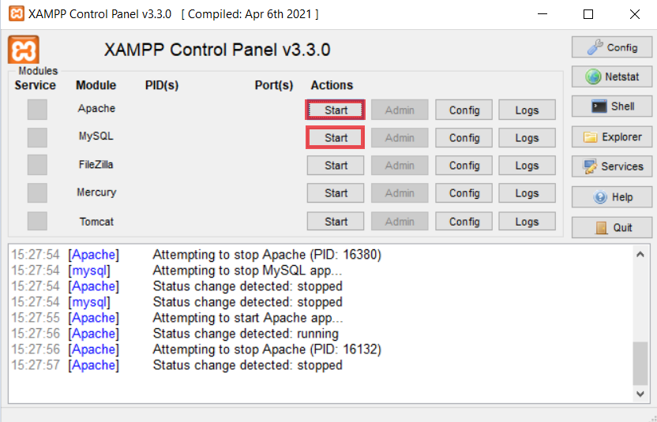
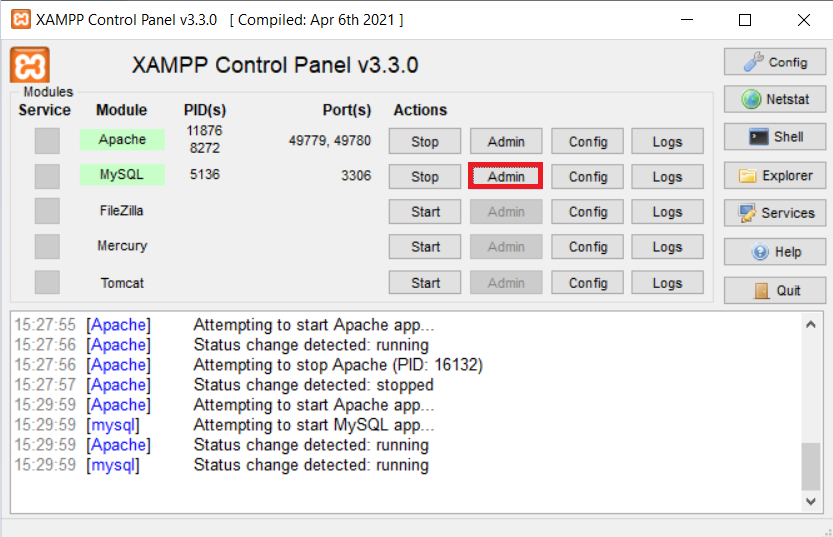
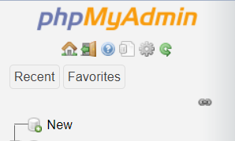
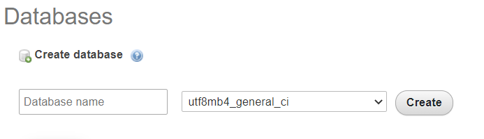

1) Run VENV library module as script 
   * `python -m venv venv`
2) Activate VENV
    * `venv/Scripts/activate`
3) Install aiogram
    * `pip install aiogram`
    * `pip install aiogram_calendar`
4) Install xampp
    * start *Apache* and *MySql* module
   
    * press *Admin* button in *MySql* module
   
    * press **New** button
   
    * fill db name with **tour_bot** and create
   
   
If script execution disabled
    run in terminal
        `Set-ExecutionPolicy RemoteSigned`